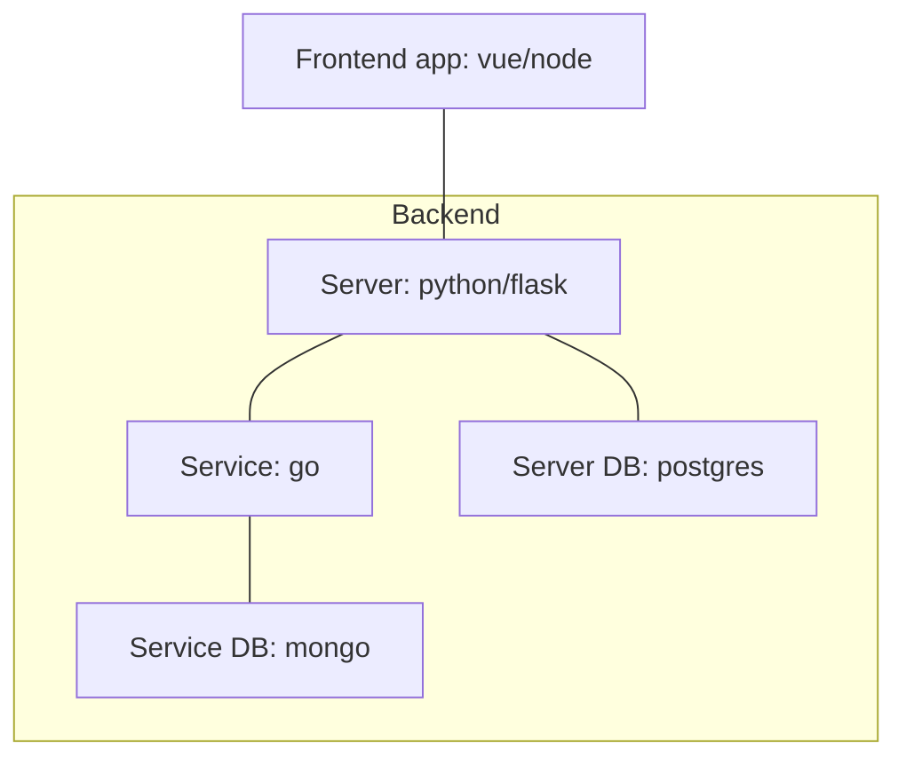

# Implementation task

In this task, you are given an existing project that consists of multiple service. Your task is to implement dockerfiles for each service and docker-compose file to run the services.
Think about developer experience. Try to follow [docker best-practices](https://docs.docker.com/build/building/best-practices/), especially:
- Multi-stage build
- Minimize the size of images
- Think about caching
- Pin versions of base images

You can create more then one dockerfile for each service, and more then one docker-compose file in the project. There is no one correct setup in this task. You can see an example solution at the `implementation-solution` branch.

## Project architecture

- [frontend](./frontend/README.md)
- [server](./server/README.md)
- [service](./service/README.md)

## Hints & tips

- If you are not sure how to write a Dockerfile for a specific service, you can use `Dockerfile.template` file
- If you are not sure how to write a docker-compose file, you can use `docker-compose.template.yml` file
- If you are short on time, you can copy the Dockerfiles from the `implementation-solution` branch and only write the docker-compose file