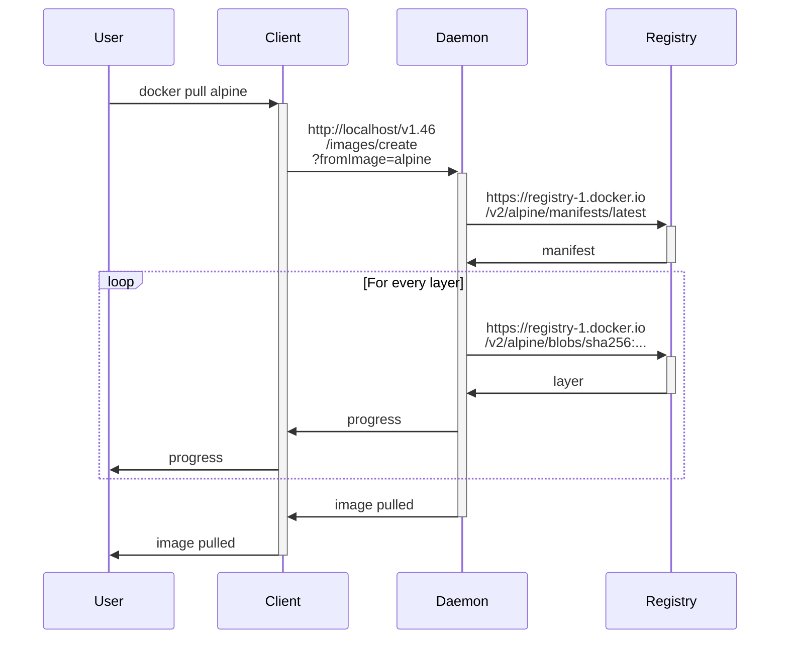
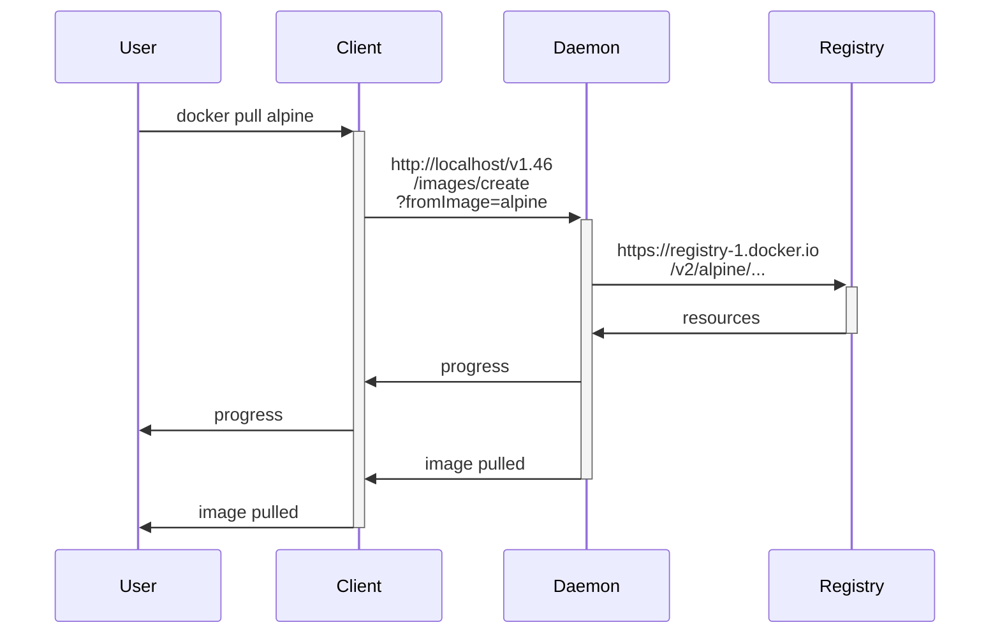

Full: 

```mermaid
sequenceDiagram
    User->>+Client: docker pull alpine
    Client->>+Daemon: http://localhost/v1.46<br>/images/create<br>?fromImage=alpine
    Daemon->>+Registry: https://registry-1.docker.io<br>/v2/alpine/manifests/latest
    Registry->>-Daemon: manifest
    loop For every layer
        Daemon->>+Registry: https://registry-1.docker.io<br>/v2/alpine/blobs/sha256:...
        Registry->>-Daemon: layer
        Daemon->>Client: progress
        Client ->> User: progress
    end
    Daemon ->>- Client: image pulled
    Client ->>- User: image pulled
```

Simplified:

```mermaid
sequenceDiagram
    User->>+Client: docker pull alpine
    Client->>+Daemon: http://localhost/v1.46<br>/images/create<br>?fromImage=alpine
    Daemon->>+Registry: https://registry-1.docker.io<br>/v2/alpine/...
    Registry->>-Daemon: resources
    Daemon->>Client: progress
    Client ->> User: progress
    Daemon ->>- Client: image pulled
    Client ->>- User: image pulled
```